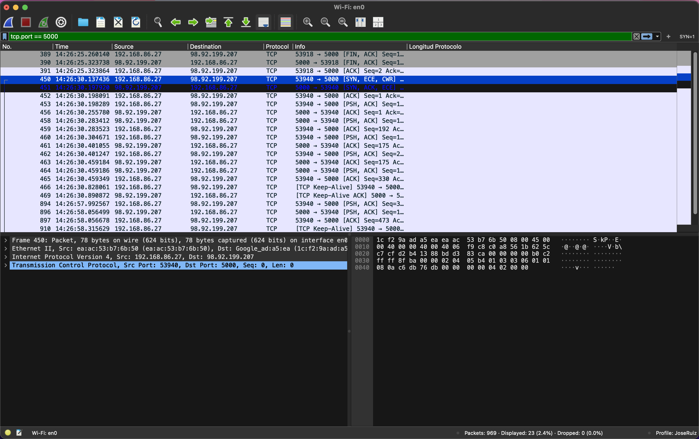
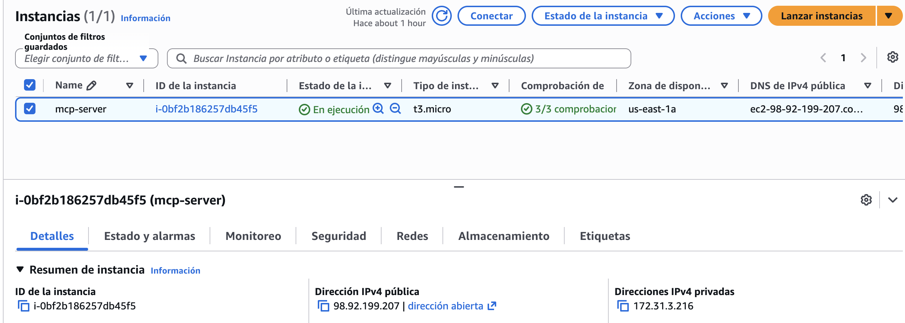
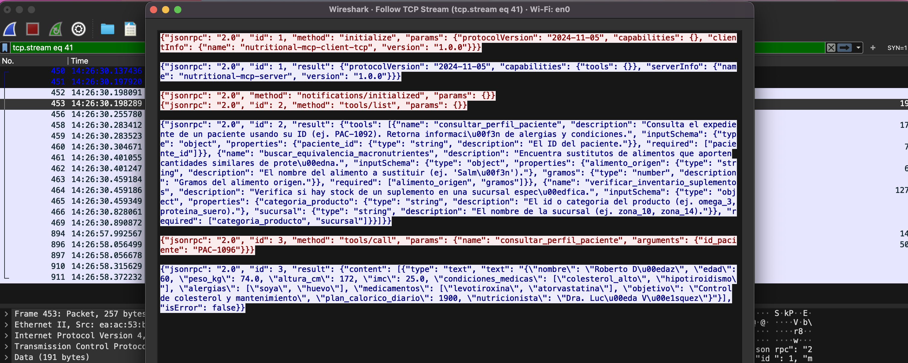
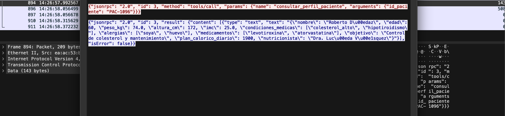
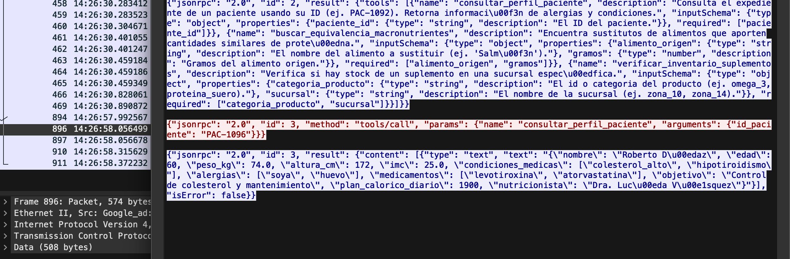

# Reporte Final - Proyecto 1: Implementación de Protocolo MCP

**Curso:** CC3067 Redes
**Estudiante:** José Gerardo Ruiz García — 23719

---

## 1. Especificación de los Servidores MCP
El proyecto implementa un servidor MCP Nutricional propio con 3 herramientas principales (la especificación técnica, esquemas JSON y parámetros se encuentran detallados en el archivo `README.md` sección 4).

Adicionalmente, se integraron los servidores oficiales de Anthropic:
- **Filesystem MCP:** Para lectura y escritura de archivos locales.
- **Git MCP:** Para control de versiones (add, commit, status, log).

---

## 2. Análisis de Tráfico con Wireshark (Modelo OSI)

Al desplegar el servidor nutricional en AWS (EC2) y utilizar un túnel TCP plano en el puerto 5000 (`socat`), fue posible capturar las tramas de red sin encriptación TLS, permitiendo un análisis claro del protocolo JSON-RPC.



### Análisis por Capas

#### Capa de Enlace de Datos (Capa 2)
Wireshark identifica las tramas a nivel de Ethernet II (o IEEE 802.11 si se usó Wi-Fi). En esta capa se observan las **direcciones MAC** de origen (tarjeta de red física de la computadora) y la dirección MAC de destino (la interfaz del router local/Gateway que reenvía el paquete hacia Internet). 

#### Capa de Red (Capa 3)
El protocolo utilizado es **IPv4**. En los paquetes capturados se puede observar:
- **IP Origen:** La dirección IP privada de la computadora local (ej. 192.168.x.x) en peticiones salientes.
- **IP Destino:** La dirección IP pública de la instancia de AWS EC2 (`98.92.199.207`).
*(Nota: Dado que las IPs públicas en AWS EC2 son dinámicas y pueden cambiar al detener/iniciar la instancia, se adjunta captura de la consola evidenciando la IP que tenía el servidor al momento del análisis).*



Se observa cómo el NAT (Network Address Translation) del router permite la salida hacia la red pública.

#### Capa de Transporte (Capa 4)
Se utiliza el protocolo **TCP** (Transmission Control Protocol).
- **Puerto Destino:** 5000 (puerto abierto en el Security Group de AWS).
- **Puerto Origen:** Un puerto efímero dinámico asignado por el sistema operativo cliente (ej. 54321).
En Wireshark se puede evidenciar claramente el **Three-way Handshake** (`SYN`, `SYN-ACK`, `ACK`) al inicio de la conexión cuando el chatbot arranca. Asimismo, TCP garantiza la entrega ordenada y sin errores del texto JSON-RPC.

#### Capa de Aplicación (Capa 7)
La carga útil (payload) del segmento TCP contiene el texto en crudo del protocolo **JSON-RPC 2.0** que da vida al Model Context Protocol (MCP). Al no usar HTTP/HTTPS, el JSON viaja directamente sobre TCP.

---

## 3. Identificación de Mensajes MCP en Wireshark

Al analizar los payloads de los paquetes TCP, se identifican las 3 fases clave de MCP:

### A. Mensajes de Sincronización / Inicialización
Inmediatamente después del Handshake TCP, el cliente envía la petición `initialize` para negociar la versión del protocolo.
**Petición (Cliente -> Servidor):**
```json
{"jsonrpc": "2.0", "id": 1, "method": "initialize", "params": {"protocolVersion": "2024-11-05", "capabilities": {}, "clientInfo": {"name": "nutritional-mcp-client-tcp", "version": "1.0.0"}}}
```
**Respuesta (Servidor -> Cliente):**
```json
{"jsonrpc": "2.0", "id": 1, "result": {"protocolVersion": "2024-11-05", "capabilities": {}, "serverInfo": {"name": "nutricional-server", "version": "1.0.0"}}}
```


### B. Mensajes de Solicitud (Petición)
Ocurre cuando el LLM decide usar una herramienta (ej. `consultar_perfil_paciente`).
**Petición:**
```json
{"jsonrpc": "2.0", "id": 3, "method": "tools/call", "params": {"name": "consultar_perfil_paciente", "arguments": {"paciente_id": "PAC-1096"}}}
```


### C. Mensajes de Respuesta
El servidor ejecuta la lógica en Python y devuelve el resultado clínico al LLM.
**Respuesta:**
```json
{"jsonrpc": "2.0", "id": 3, "result": {"content": [{"type": "text", "text": "Perfil del paciente PAC-1096..."}]}}
```


---

## 4. Conclusiones y Comentarios del Proyecto

1. **Interoperabilidad y Estandarización:** El desarrollo manual del protocolo MCP demostró cómo JSON-RPC 2.0 actúa como un lenguaje universal. Al apegarse al estándar, el servidor nutricional desarrollado puede ser consumido por cualquier cliente MCP (como Claude Desktop o Cursor), demostrando que MCP elimina la necesidad de programar integraciones específicas para cada IA.
2. **Abstracción de Capas OSI:** Evidenciamos que la implementación de un protocolo a nivel de Capa de Aplicación (7) es agnóstica de las capas inferiores. El mismo código de servidor JSON-RPC funcionó localmente (usando tuberías `stdio`) y remotamente (usando sockets `TCP/IP` a través de AWS), delegando el control de flujo y enrutamiento a TCP e IP respectivamente.
3. **Seguridad y Aislamiento:** MCP demuestra ser una arquitectura segura para conectar IA a bases de datos privadas de la industria médica. El LLM (Qwen) nunca tuvo acceso a los archivos CSV o JSON reales; solo interactuó con funciones estrictamente definidas (RPC), actuando el servidor como una barrera de seguridad que valida los parámetros antes de ejecutarlos.
4. **Desafíos Técnicos:** El mayor reto fue lidiar con las "alucinaciones" de esquema del LLM gratuito utilizado (Qwen 3.8), el cual en ocasiones enviaba parámetros JSON malformados o strings en lugar de arreglos (como en el caso de la herramienta `git_add`). Esto exigió implementar una capa de sanitización y validación estricta en el cliente para garantizar que el protocolo JSON-RPC no se rompiera.
